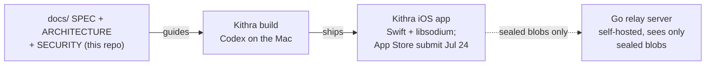

# Repo map: what every file is for

The one-page orientation for this repository. If the structure changes, update this file and regenerate the visual map in the same pull request (`node docs/make-repo-map.mjs` rewrites `speakeasy-map.excalidraw` at the repo root; drawing rules live in `Repos/.claude/diagram-guidelines.md`).

Last verified: 2026-07-16.

## The one-sentence version

This repo is the paper behind Kithra (working name speakeasy): the spec, architecture, and security model for an end-to-end encrypted, self-hosted video-messaging app; the app itself is being built from these docs on the Mac, with App Store submission targeted for July 24.

## What lives where

| File / folder | What it is | Touch it when |
|---|---|---|
| [README.md](../README.md) | The public pitch: why Marco Polo's privacy rating is a WARNING, and the comparison table only Speakeasy fills (end-to-end encrypted + self-hosted + open source + async video). | The positioning or scope changes. |
| `docs/` | [SPEC.md](SPEC.md) (the MVP scope and flows), [ARCHITECTURE.md](ARCHITECTURE.md) (Go relay + Swift iOS client, and the planned `server/` + `ios/` layout), [SECURITY.md](SECURITY.md) (libsodium crypto model, threat model), this map, and [MARKETING.md](MARKETING.md). | The design changes; keep SPEC and the app honest with each other. |
| `LICENSE` | MIT. Open source is part of the trust story. | Never, realistically. |
| `.gitignore` + local `secrets/` | `secrets/` exists only on this machine (kept out via `.git/info/exclude`); never stage it. | Never stage secrets, in any repo. |
| `archive/` | `CODEOWNERS` from the collaboration era: Joshua Ohana started the repo off and moved on (2026-07); the repo is solely Joaquim's now. | Never; it exists so history is browsable. |

Root file `speakeasy-map.excalidraw` is the visual version of this page.

## How the app gets made (and what the repo is NOT)

Two details worth remembering when explaining this:

1. This checkout is the paper, not the product. The `server/` and `ios/` folders in ARCHITECTURE.md are the planned layout; the working app code is on the Mac and lands here when it's ready. Nothing in this repo builds or deploys.
2. The server is deliberately dumb. Keys never leave the devices, so the relay (even Joaquim's own) can store and forward videos it can never watch. What it does see, honestly: who messaged whom, when, and how big the blob was.
