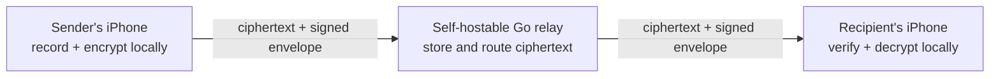

# Repository map

This is the current text map of the Speakeasy repository. The public product is
the Kithra native iPhone app. Run `node docs/make-repo-map.mjs` and then
`node docs/render-map-preview.mjs` whenever this map changes so the Excalidraw
and SVG versions stay synchronized.

Last verified: 2026-08-04.

## Current state

This repository contains an implemented Go relay, a native Swift/SwiftUI iPhone
client, protocol tests, deployment assets, and release tooling. Kithra is still
pre-submission: it has no public App Store URL and is not currently in App Store
review. Internal TestFlight is for smoke-testing the exact release candidate,
not public distribution.

## What lives where

| Path | Purpose |
|---|---|
| [`server/`](../server/) | Go relay with SQLite metadata and local-filesystem ciphertext storage. |
| [`ios/`](../ios/) | Native Kithra iPhone client, XCTest target, Xcode project, and Fastlane tooling. |
| [`android/`](../android/) | Native Kotlin scaffold for a later release; it is not a usable V1 client. |
| [`deploy/`](../deploy/) and [`docker-compose.yml`](../docker-compose.yml) | Relay and public support-site deployment assets. Self-hosting applies to the relay, not installation of the iPhone app. |
| [`.github/workflows/`](../.github/workflows/) | Locally signed iPhone simulator tests, Go relay checks, and Android scaffold builds; no Apple distribution credentials are used. |
| [`testdata/protocol/`](../testdata/protocol/) | Shared fixed vectors for identity verification and Message Envelope v2. |
| [`docs/`](./) | Build status, API, protocol, security, deployment, owner setup, and App Store preparation. |
| [`marketing/`](../marketing/) | Unpublished launch planning and draft posts. Nothing there is ready to publish without a final factual review. |
| [`README.md`](../README.md) | Public project overview. |

Root file [`speakeasy-map.excalidraw`](../speakeasy-map.excalidraw) is the visual
version of this page. [`map-preview.svg`](map-preview.svg) and
[`map-preview.png`](map-preview.png) are generated previews.

## Runtime path

```mermaid
flowchart LR
  A["Sender's iPhone\nrecord + encrypt locally"]
  R["Self-hostable Go relay\nstore and route ciphertext"]
  B["Recipient's iPhone\nverify + decrypt locally"]

  A -->|ciphertext + signed envelope| R
  R -->|ciphertext + signed envelope| B
```

- Each video receives a fresh random content key. That limits the effect of a
  single content-key exposure, but V1 has no prekey ratchet and does not provide
  Signal-style forward secrecy.
- Users can compare a 60-digit safety number or scan a signed, peer-specific QR
  code to pin the expected device keys. Signed Message Envelope v2 then binds
  message metadata and ciphertext to those keys.
- The relay cannot decrypt verified message content. It still sees routing and
  timing metadata and can delay, replay, reorder, or withhold ciphertext.
- The current server stores blobs on the local filesystem. Optional
  S3-compatible storage is not implemented.
